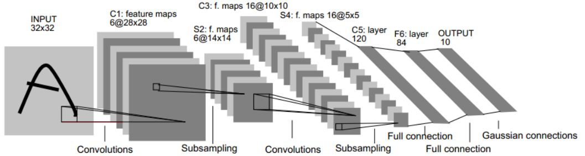
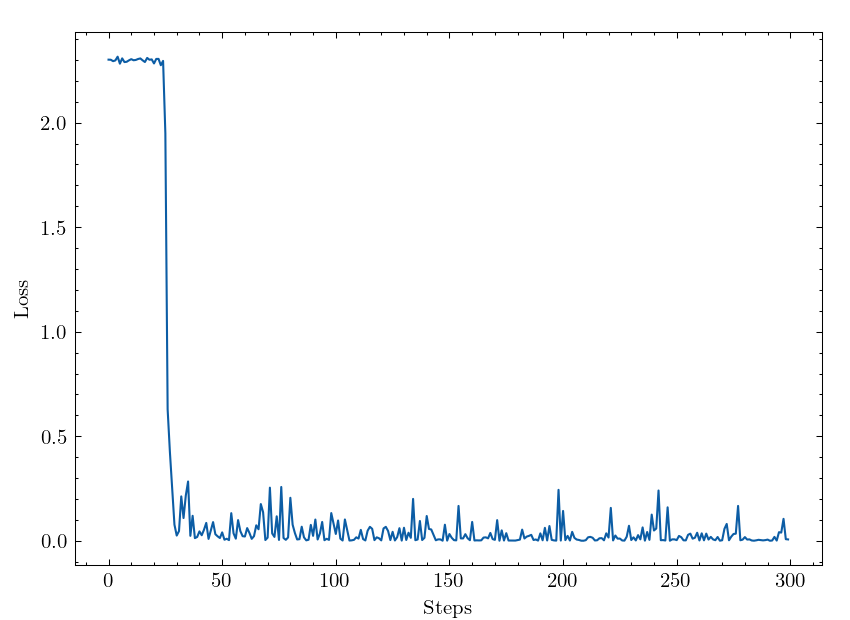
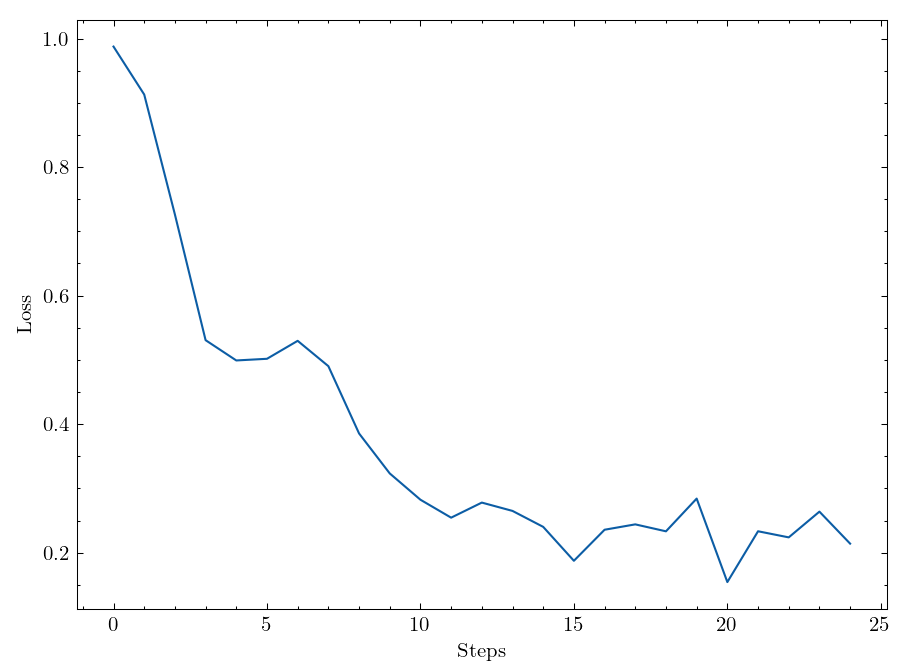

- [第六次实验](#第六次实验)
  - [实验要求](#实验要求)
  - [实验环境](#实验环境)
    - [硬件环境](#硬件环境)
    - [软件环境](#软件环境)
    - [软件环境的准备](#软件环境的准备)
  - [MINST手写数字识别](#minst手写数字识别)
    - [TODO1：图像放缩](#todo1图像放缩)
    - [TODO2：归一化](#todo2归一化)
    - [TODO3：进行shuffle、batch、repeat操作](#todo3进行shufflebatchrepeat操作)
    - [TODO4：根据LeNet5网络结构神经网络](#todo4根据lenet5网络结构神经网络)
    - [TODO5：选择损失函数](#todo5选择损失函数)
    - [TODO6：选择优化器](#todo6选择优化器)
    - [TODO7：定义训练方法](#todo7定义训练方法)
    - [TODO8：定义验证方法](#todo8定义验证方法)
    - [MNIST手写数据识别预测结果](#mnist手写数据识别预测结果)
  - [鸢尾花三分类](#鸢尾花三分类)
    - [TODO1：读取数据集](#todo1读取数据集)
    - [TODO2：分别将Iris-setosa，Iris-versicolor，Iris-virginica对应为0，1，2三类](#todo2分别将iris-setosairis-versicoloriris-virginica对应为012三类)
    - [TODO3：Using random choice and split dataset into train set and validation set by 8:2.](#todo3using-random-choice-and-split-dataset-into-train-set-and-validation-set-by-82)
    - [TODO4：Convert the test data to MindSpore Dataset](#todo4convert-the-test-data-to-mindspore-dataset)
    - [TODO5：使用交叉熵损失计算](#todo5使用交叉熵损失计算)
    - [TODO6：使用动量优化器优化参数，其中学习率设置为0.05，动量设置为0.9](#todo6使用动量优化器优化参数其中学习率设置为005动量设置为09)
    - [TODO7：设置路径](#todo7设置路径)
    - [鸢尾花三分类预测结果](#鸢尾花三分类预测结果)
  - [个人体会](#个人体会)

<div STYLE="page-break-after: always;"></div>

# 第六次实验

## 实验要求

- 使用 `mindspore`构建模型解决鸢尾花三分类问题。
- 使用 `mindspore`构建模型进行MNIST手写数字识别。
- 鸢尾花三分类的准确率在95%以上。
- MNIST手写数据集的测试准确率应该在95%以上。

## 实验环境

### 硬件环境

- OS：Manjaro Linux x86_64
- Kernel: 5.15.106-1-MANJARO
- CPU: AMD Ryzen 7 5800H with Radeon Graphics (16) @ 3.200GHz
- GPU: NVIDIA GeForce GTX 1650 Mobile / Max-Q
- Memory: 13832MiB

### 软件环境

- mindspore-gpu 1.9.0
- Python 3.7.0
- numpy 1.21.6

### 软件环境的准备

- 安装mindspore

  1. 新建并激活 `conda`环境

  ```
      conda create -c conda-forge -n mindspore_py37 python=3.7.5 -y
      conda activate mindspore_py37
  ```

  2. 安装mindspore

  ```
      conda install mindspore -c mindspore -c conda-forge
  ```

  3. 检查是否安装成功

  ```
      >>> python -c "import mindspore;mindspore.run_check()"
      MindSpore version: 1.9.0
      The result of multiplication calculation is correct,
      MindSpore has been installed successfully!
  ```

## MINST手写数字识别

### TODO1：图像放缩

在LeNet-5[^1]中输入层（Input
Layer）的图像大小是$32 \times 32$。为了与论文中的模型尽量保持一致，在图像放缩中将 `resize_height`与 `resize_width`都设置成$32$：

    # Todo 设置放缩的大小
    resize_height, resize_width = 32, 32

### TODO2：归一化

MNIST手写数据集中的图像属于灰度图，其中每一个像素由一个在集合$[0, 255] \cap \mathbb{Z}$中的整数来表示，数字越大则灰度越深。

由此，在归一化的过程中我们需要将归一化参数 `rescale`设置成$\frac{1}{255}$：

    rescale = 1 / 255

### TODO3：进行shuffle、batch、repeat操作

#### shuffle操作

`shuffle` 操作是将数据随机打乱，如下图所示：


`shuffle`的目的防止数据中出现含有相同的标签的样本聚在一起的情况出现。正如扑克牌中的洗牌过程，其目的是为了防止同花色或同数字的牌聚在一起。`shuffle`实现方式如下：

    buffer_size = 10000
    mnist_ds = mnist_ds.shuffle(buffer_size = buffer_size)

其中 `buffer_size`参数是混洗缓冲区的大小，其数值越大，混洗程度越大。

#### batch操作

`batch`操作是将数据集分成一个个的小批量（batch），如下图所示：


在训练的迭代过程中，会将数据集分成的一个个小批量依次输入到网络中进行训练。这样做的目的是防止网络过拟合，同时也避免了数据量太大导致内存或显存中不能同时存放这么多的数据而引起内存错误。`batch`操作实现方式如下所示：

    mnist_ds = mnist_ds.batch(batch_size = batch_size)

#### repeat操作

在训练的过程中，会将数据集多次输入到网络中进行训练，如下如所示：


`repeat`操作的目的是将训练集进行重复，便于多次将训练集输入到网络中进行训练。`repeat`操作的实现方式如下所示：

    mnist_ds = mnist_ds.repeat(repeat_size)

### TODO4：根据LeNet5网络结构神经网络

本实验中根据论文[^1]中的网络结构进行设计，LeNet5网络结构如下所示：



#### $INPUT \rightarrow C1$的卷积层实现

卷积层输入图像分辨率和输出图像分辨率之间的关系如下所示：

$$
W_{out} = \frac{W_{in} - F + 2P}{S} + 1
$$

其中，$W_{out}$是输出图像的宽度，$W_{in}$是输入图像的宽度，$F$是卷积核的大小，$P$是填充大小，$S$是步长。

由$INPUT$和$C1$图像的宽度分别为$32$和$28$可知，只要取$F = 5$，$S = 1$以及$P = 0$即可得到$28 \times 28$的输出。实现方式如下所示：

    self.conv1 = nn.Conv2d(in_channels = num_channel, out_channels = 6,
    kernel_size = (5, 5), has_bias=True, pad_mode='valid')
    self.relu1 = nn.ReLU()

注意到$C1$层图像有六个通道，因此我们将 `out_channels`参数设为$6$。

本实验中在卷积层的后面用$ReLU$函数作为激活函数，其中$ReLU$函数的公式如下：

$$
ReLU(x) = max\{0, x\}
$$

#### $C1 \rightarrow S2$降采样层的实现

由$C1$的图像宽度和$S2$的图像宽度分别为$28$和$14$可以知道，我们只需要采用 `kernel_size=2, stride=2`的降采样层即可。实现方式如下：

    self.max_pool1 = nn.MaxPool2d(kernel_size = (2, 2), stride = 2)

#### $S2 \rightarrow C3$卷积层的实现

由$S2$和$C3$图像的宽度分别为$14$和$10$可知，只要取$F = 5$，$S = 1$以及$P = 0$即可得到$10 \times 10$的输出。实现方式如下所示：

    self.conv2 = nn.Conv2d(in_channels = 6, out_channels = 16,
    kernel_size = (5, 5), has_bias=True, pad_mode='valid')
    self.relu2 = nn.ReLU()

注意到$C3$层图像有$16$个通道，因此我们将 `out_channels`参数设为$16$。

#### $C3 \rightarrow S4$降采样层的实现

由$C3$的图像宽度和$S4$的图像宽度分别为$10$和$5$可以知道，我们只需要采用 `kernel_size=2, stride=2`的降采样层即可。实现方式如下：

    self.max_pool = nn.MaxPool2d(kernel_size = (2, 2), stride = 2)

#### $S4 \rightarrow C5$的卷积层

由$S4$和$C5$图像的宽度分别为$5$和$1$可知，只要取$F = 5$，$S = 1$以及$P = 0$即可得到\$
`\times 1`{=tex}\$的输出。实现方式如下所示：

    self.conv3 = nn.Conv2d(in_channels = 16, out_channels = 120,
    kernel_size = (5, 5), has_bias = True, pad_mode='valid')
    self.squeeze = ops.Squeeze(axis = (-1, -2))

注意到$C5$层图像有$120$个通道，因此我们将 `out_channels`参数设为$120$。

在$C5$层中我们得到的数据 `size`为$batch \times 1 \times 1 \times 120$，为了与接下来的全连接层输入相配合，我们需要使用 `mindspore`内置的 `Squeeze`算子将两个长度为$1$的维度去掉，得到的数据新的 `size`为$batch \times 120$。

#### $C5 \rightarrow F6$全连接层的实现

根据$C5$和$F6$的特征维度分别为$120$与$84$，将 `in_feature`与 `out_feature`两个参数分别设置为$120$和$84$。实现方式如下：

    self.fc = nn.Dense(120, 84, activation = 'tanh')

在 `fc`层中，我使用了$Tanh$函数作为激活函数，其公式如下：

$$
Tanh(x) = \frac{e^x-e^{-x}}{e^x+e^{-x}}
$$

#### $F6 \rightarrow OUTPUT$的全连接层实现

根据$F6$和$OUTPUT$的特征维度分别为$84$与$10$，将 `in_feature`与 `out_feature`两个参数分别设置为$84$和$10$。实现方式如下：

    self.out_fc = nn.Dense(84, num_class, activation = None)

#### 使用定义好的运算构建前向网络

根据上面构建好的网络，将输入分别通过各个层即可得到输出。其前线网络实现方式如下所示：

    def construct(self, x):
        x = self.relu1(self.conv1(x))
        x = self.max_pool1(x)
        x = self.relu2(self.conv2(x))
        x = self.max_pool2(x)
        x = self.squeeze(self.conv3(x))
        x = self.fc(x)
        x = self.out_fc(x)
        return x

### TODO5：选择损失函数

对于多分类问题，我采用$SoftMaxCrossEntropy$函数作为损失函数，其表达式为：

$$
SoftmaxCrossEntropy(x,y)=−\sum_{i} y_ilog(\frac{e^{x_i}}{\sum_{j} e^{x_j}})
$$ 其中x表示未归一化的分数，y表示真实标签的独热编码。

具体实现如下：

    net_loss = nn.SoftmaxCrossEntropyWithLogits(sparse=True,\
                                                reduction='mean')

### TODO6：选择优化器

我选择了`Momentum`优化器作为本次实验的优化器。

其实现方式如下：

    net_opt = nn.Momentum(net.trainable_params(),\
                            learning_rate=0.01, momentum=0.9)

### TODO7：定义训练方法

使用`mindspore`训练网络十分方便，只需要将数据集、网络、损失函数以及优化器放入`mindspore`的`Model`类中，再调用`train`接口即可。这极大地降低了深度学习的准入门槛，不愧是国产之光！

在`train_net`函数中实现如下：

    ds_train = create_dataset(os.path.join(data_path, "train"), repeat_size = repeat_size)
    model.train(epoch_size, ds_train, callbacks=[ckpoint_cb,\
    LossMonitor(125)], dataset_sink_mode=sink_mode)

### TODO8：定义验证方法

使用`mindspore`验证网络也十分方便，只需要调用`mindspore`的`Model`类的`train`接口即可。

在`test_net`函数中实现如下：

    ds_eval = create_dataset(os.path.join(data_path, "test"))
    acc = model.eval(ds_eval, dataset_sink_mode=False)
    print(f"acc : {acc['Accuracy']:.4f}")

### MNIST手写数据识别预测结果

执行填空后的脚本，可以得到`Model.train`方法输出的一系列损失，将其汇总到一起得到如下损失曲线：

<div align=center>

</div>

可以看到损失函数曲线很快就下降到了一个较低的值，不愧是`mindspore`！

最终准确率：

`acc : 0.9845`

## 鸢尾花三分类

### TODO1：读取数据集

使用`csv`库中提供的`reader`方法即可读取数据集，实现方式如下：

    with open(data_path) as f:
        data = list(csv.reader(f, delimiter=','))

### TODO2：分别将Iris-setosa，Iris-versicolor，Iris-virginica对应为0，1，2三类

使用字典将三个标签分别与0, 1, 2三个整数对应起来：

    label_map = {
        'Iris-setosa': 0,
        'Iris-versicolor': 1,
        'Iris-virginica': 2
    }

### TODO3：Using random choice and split dataset into train set and validation set by 8:2.

首先使用`numpy.arange`方法生成$index = [0, 1, 2 \dots 149]$作为数据的索引，接着使用`numpy.random.shuffle`方法将$index$打乱，最后取$index$的前$150 \times \frac{8}{8 + 2} = 120$个索引作为训练集的索引，剩下的索引作为测试集的索引。

实现方式如下：

    index = np.arange(150)
    np.random.shuffle(index)
    train_idx   = index[:120]
    test_idx    = index[120:]

### TODO4：Convert the test data to MindSpore Dataset

将测试集的特征部分和标签部分合成一个张量，再调用`mindspore.dataset.GeneratorDataset`的构造方法构造一个数据集对象即可。在构造数据集的过程中我将它以$32$为大小划分`batch`。

实现方法如下所示：

    XY_test = list(zip(X_test, Y_test))
    ds_test = dataset.GeneratorDataset(XY_test, ['x', 'y'])
    ds_test = ds_test.batch(32)

### TODO5：使用交叉熵损失计算

直接调用`mindspore`中的`SoftmaxCrossEntropyWithLogits`即可实现交叉熵损失函数的计算。

    loss = nn.loss.SoftmaxCrossEntropyWithLogits(sparse=True, reduction='mean')

### TODO6：使用动量优化器优化参数，其中学习率设置为0.05，动量设置为0.9

根据要求填入相应的参数。

    opt = nn.optim.Momentum(net.trainable_params(), learning_rate=0.05, momentum=0.9)

### TODO7：设置路径

根据训练脚本与数据即的相对位置设置数据集的路径。

    data_path = 'iris.data'

### 鸢尾花三分类预测结果

执行填空后的脚本，可以得到`Model.train`方法输出的一系列损失，将其汇总到一起得到如下损失曲线：
<div align=center>

</div>

上述损失曲线抖动过大的原因在于数据集的样本数量太少，以及脚本中设置的训练次数仅为$25$次，导致模型没有完全收敛。考虑到本次实验是填空题，我将不对训练次数等其他参数做修改。

测试集的准确率： `'acc': 0.9667`

## 个人体会

由于我最近正好在参与将强化学习算法从`tensorflow`上移植到`mindspore`上的工作，因此我对与`mindspore`这个深度学习框架并不感到陌生。在使用刚开始使用`mindspore`的时候，它给我的感觉是不如传统的深度学习框架（`pytorch`、`tensorflow`等）那么易于使用。但是再经过移植工作以及本次实验之后，我对`mindspore`有了不一样的看法。

`mindspore`作为一个新生的国产深度学习框架，其生态确实没有传统的深度学习框架这么完善。但如果深入了解`mindspore`并以正确的方式使用它，你会发现`mindspore`在性能和速度方面要并不弱于`tensorflow`和`pytorch`，并且在许多任务上`mindspore`的效率要远高于这两个传统的框架。

知乎上有一篇文章：[MindSpore:
从满怀期待到鼻青脸肿](https://zhuanlan.zhihu.com/p/574499064)，作者通篇文章都在抱怨`mindspore`的不好，同时将其与传统深度学习框架进行了不恰当的对比。但在我看来，`mindspore`并没有文章的作者所说的这么不堪，文章作者"鼻青脸肿"的经历大多是因为其对框架的不熟悉以及不了解。

例如文章的作者在开头提到以下代码：

    if c1 or c2:
        v1 = 1
    ....
    if c1:
        v2 = v1 * 2

在静态图模式下会报错：
`NameError: The name 'v1' is not defined, or notsupported in graph mode.`
这实际上是静态举模式的特点，在分支中使用某个变量必须在分支前提前定义。在分支外将`v1`初始化为`None`则不会出现这样的报错。这就好像在`tensorflow`中构建静态图前要先使用`placeholder`定义输入网络的变量一样。

还有文章作者在提到的

> 跟pytorch比较实际上是欺负Mindspore。
> 两者实现模型的时候，表面上并无本质区别，但与pytorch几乎完美、优雅的pythonic代码相比，MS代码就显得有些丑陋，而且不灵活，所有的模块（包括loss）都必须套在大大小小的cell里面，对于复杂模型来说，十分的僵硬。

但我却不这么认为。`mindspore`将计算图全部封装在`cell`中，实际上是看重计算图的显式表达。你可以依靠`cell`把网络运算过程放入计算图中，而把其他一些计算过程放在计算图之外。这一点在`pytorch`这样不显式的构造计算图的框架中是很难做到的。

`mindspore`在性能上也不弱于传统的深度学习框架。我在强化学习算法移植的工作中，在相同的网络（含有线性层和卷积层）下进行过测试，`mindspore`前向传播消耗的速度可以比`tensorflow`前向传播的速度快30%\~40%。

在使用`mindspore`的过程中，我也遇到了一些问题。在`predict`过程中，`mindspore`的表现并没有`tensorflow`好。但是经过我们的排查之后发现，这是因为`mindspore`在没有进行任何调优的时候默认给actor和CPU算子核使用30个线程，但是在多线程的场景下，计算机同时并行的线程数量可能不能满足`mindspore`的线程数量要求，因而导致性能急剧下降。这个问题可以通过简单地调用`set_context`函数设定`runtime_num_threads`来解决。

对于一个新生的深度学习框架，`mindspore`已经做得非常不错了。`mindspore`的生态环境确实比不上传统的深度学习框架，但是作为一个新生儿，其成长过程需要有广大的开发者陪同。作为一名支持华为的学生，我希望看到的是志向远大的开发者对`mindspore`抱有一种宽容的态度，为完善国产框架的生态环境尽自己的一份力量。我也相信，在不久的将来`mindspore`会比现在做得更好！

[^1]: Y. Lecun, L. Bottou, Y. Bengio and P. Haffner, "Gradient-based
    learning applied to document recognition," in Proceedings of the
    IEEE, vol. 86, no. 11, pp. 2278-2324, Nov. 1998, doi:
    10.1109/5.726791.

